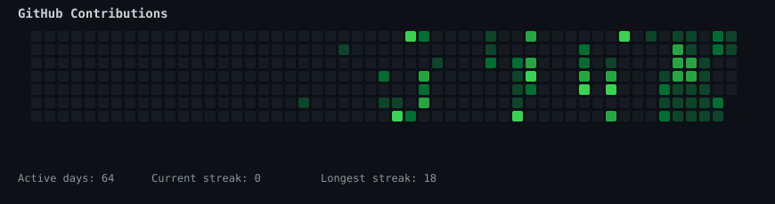

<div align="center">

<h2><code>abiodun@github ~ $ ./contributions.sh</code></h2>



<br><br>

<h2><code>abiodun@github ~ $ whoami</code></h2>

<table>
<tr>

<td valign="top">



</td>

<td valign="top">



</td>

</tr>
</table>

</div>

---

## About Me

```text
Name        : Abiodun Caleb Adesesan
Role        : Software Engineer
Location    : Nigeria 🇳🇬
Currently   : AI • Machine Learning • Full Stack
Faith       : Christian
```

---

## Tech Stack

```text
Frontend    React • Next.js • TypeScript • Tailwind CSS

Backend     Node.js • Express

Database    PostgreSQL • Supabase • Firebase

Tools       Git • Docker • Cursor • VS Code • Vercel
```

---

<div align="center">

[Portfolio](https://calebsilvanus.vercel.app) •
[LinkedIn](https://www.linkedin.com/in/abioduncaleb) •
<abiodunadesesan@gmail.com>

</div>
